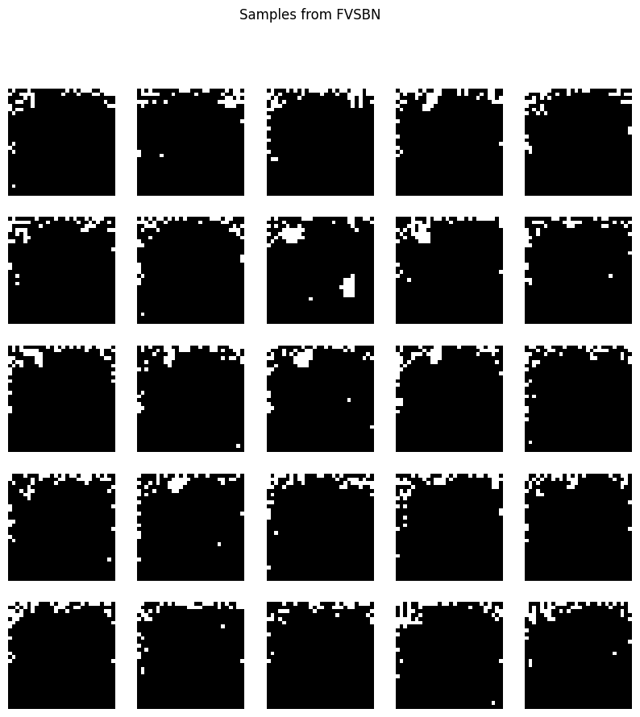
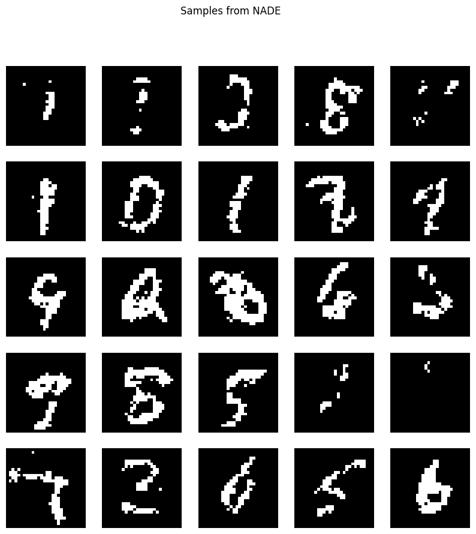
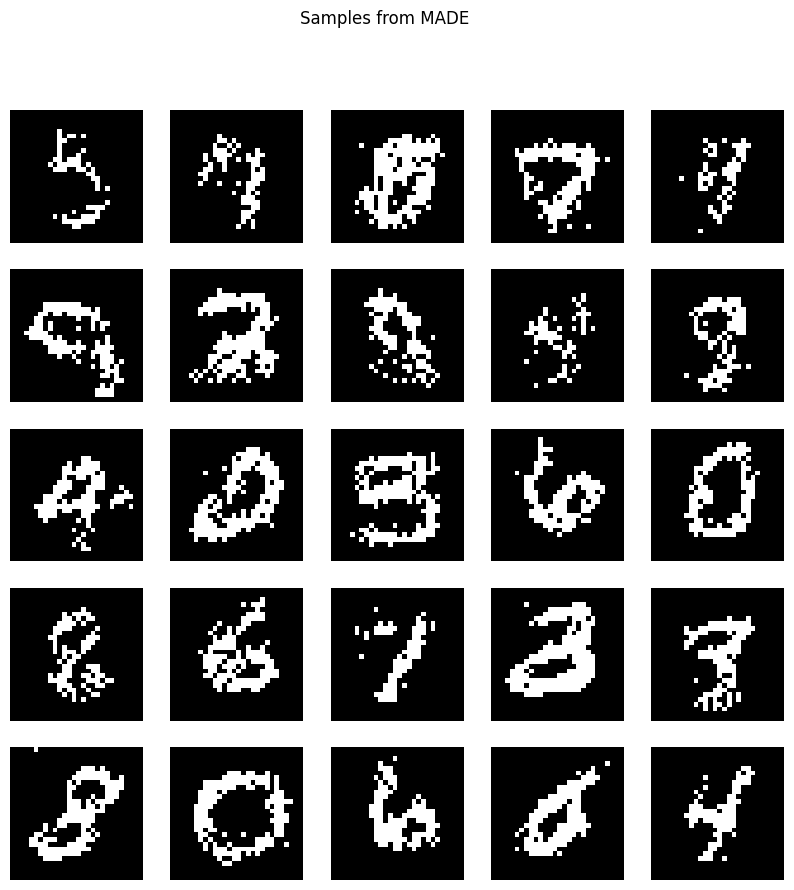

# Autoregressive Models for Distribution Estimation

This repository contains a notebook implementation of three foundational autoregressive models used for distribution estimation:

1. **Fully Visible Sigmoid Belief Network (FVSBN)**
2. **Neural Autoregressive Distribution Estimation (NADE)**
3. **Masked Autoencoder for Distribution Estimation (MADE)**
4. 
The Models were discussed in detail in the Deep Generative Models (CS236) stanford course and this is just an attempt of using them.
The models are trained on the **binarized MNIST dataset** to estimate the joint distribution of binary pixel values in handwritten digits.

## Models Overview

### 1. Fully Visible Sigmoid Belief Network (FVSBN)
FVSBN is a generative model where the joint distribution is factorized into conditional distributions. It uses visible and hidden layers with binary units to model complex distributions. This model requires complex inference but provides a foundational understanding of probabilistic graphical models.

### 2. Neural Autoregressive Distribution Estimation (NADE)
NADE improves upon traditional models by decomposing the joint distribution into conditional distributions, predicting each variable based on the previous ones in a sequence. It uses a neural network to model these conditional probabilities, allowing for efficient sequential predictions.

### 3. Masked Autoencoder for Distribution Estimation (MADE)
MADE is an extension of NADE, introducing **masking** to the weight matrices of the neural network. This allows for efficient parallelization during training and generation, making it suitable for larger datasets. The model maintains the autoregressive structure while improving training efficiency.

## Dataset

The models are trained for **20 Epochs** on the **binarized MNIST dataset**. The dataset consists of grayscale images of handwritten digits (0-9), where the pixel values are binarized into black and white.

